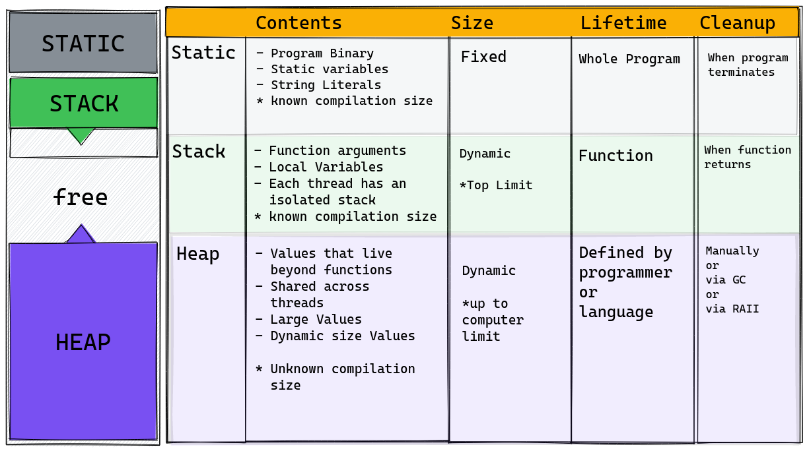

## intro

My name is Bruno I am a Senior Engineer on Ansible by Red Hat, I work mainly with Python but I have been exploring Rust for the past 5 years or so.

So my goal today is to give you an introdution to the foundations od the Rust language.

## install

To get started you need an environment where you can compile your rust program, the first and easy option is to use an online solution
like replit.com or gitpod.io.

I recommend using gitpod so you don't need to install anything locally you just need a github account then you signin to gitpod io
and then you go to the repo I shared rust-intro and then you click on the `start on gitpod` link, this will give you a complete IDE using VScode and a shell where you can install and run rust commands.

If you want to have rust environment on your local computer then the way to go is using the rustup.rs website and install following the instructions there.

## Environment

If you are using one of those web based environments you have a code editor similar to vscode, when running locally you can use any editor of choice some provides better rust support, vscode being the recommended and also Neovim has a good support and I particularly like to use an editor called micro-editor, which I will be using today.

## Hello World

To get started lets open a file called `hello.rs` and write the
traditional hello world program.

```rust
fn main() {
    println!("Hello, world!");
}
```

So some things to note:

- Rust source code has the extension `.rs`
- The entry point for binary program is the `main` function
- We use `println!` macro to print to the console

Now open a second terminal and run `rustc hello.rs` and the compiler will generate a binary with the same name and we can run it `./hello` on any computer based on the same architecture.

```console
$ ./hello
Hello, world!
```

As Rust is a compiled language every time you do changes on the source code, you need to compile again.

## Cargo

Lerger projects will be based on more than a single file, and to manage the collection of modules and dependencies Rust comes with a tool called `Cargo`, you can run `cargo new hello-world` and it creates the basic project structure which is very simple.

It has a file called `Cargo.toml` to hold all the metadata and dependency list for the project and a folder called `src` containg a `main.rs` file.

So in a binary project this `src/main.rs` is the entry point, open it on the editor and you can see that this file comes with the simple hello world.

When inside a folder containing a `Cargo.toml`  we say we are in a Rust Workspace and there we can run `cargo run` to compile and execute de project.

Cargo provides other utilities and it can be extended via plugins so we can use cargo for all administrative tasks on our project.

## Variables

Now lets open our `hello-world/src/main.rs` and start looking on how Rust variable definition works.

Cleanup all the contents and try to bind the number 5 to a variable called x. `let x = 5;`

```console
expected item found keyword
...
```

The rust compiler is very famous because of the error messages it gives, in most of the cases the message will tell you exactly what to do, in this case it is saying that the `let` statement cannot be used in the **global** scope of the program, and this is related to how Rust manages memory, lets talk about it.

## RAII

To avoid memory leaking the program must free all the space used in memory, there are languages where you need to manually manage it by calling `delete x` for example, and on the other hand there are languages where there is a Garbage Collector, a procedure that run from time to time and cleans up unused values from the memory.

Rust takes a different approach known as **RAII**, this is a pattern that has been created on the `C++` community and is integrated in the Rust typing system, so Rust needs to know where the variable has been **acquired** (declared) so it also knows the **lifetime end** of the variable which is where the variable needs to be cleaned from the memory, this is related to a thing called **OBRM** (Ownership & Borrowing Resource Management) that is an extension over the RAII pattern, lets see how it works.

We can only use `let` to define variables inside the scope of functions.

```rust
fn main() {
	// First, let statement can be used only inside the function scope
	let x = 5; // Here lifetime of x starts (it has been acquired)
	           // In rust we say that `x is the owner of the value 5`

	// .. more code ..

} // when the function goes out of scope, when the invokation returns
  // all the variables acquired in the lifetime of the function are
  // cleaned from the memory.
```

> NOTE: In the above case we are defining a primitive type, stores in
> the stack memory, so it is cleaned when the function stack frame is
> poped out, for dynamic types Rust will call a drop method to clean it.

## Unused variables

Executing this simple program will give us warnings in the console
those warnings will not block the compilation, but is highly recommended to read it because compiler will try to teach you what to do to make your program better.

```
--> src/main.rs:3:9
  |
7 |     let x = 5;
  |         ^ help: if this is intentional, prefix it with an underscore: `_x`

```

You can add `_` as a prefix so compiler ignores the unused variable or add `#![allow(unused_variables)]` annotation to the top of the function, however I don't recommend silencing the warnings during learning experience.


## Type inference

So you probably heard that Rust is a static typed language, it means that the compiler must know the type of each variable during compilation time, and in our example `let x = 5;`  we have not specified a type.

Rust can infer the type of the variable based on the literal, structure or the
context where we define it, in this case the parser will detect that the `5` literal is a valid integer and in this case the type `i32` will be the default choice, we can specify other type if we want `let x: i8 = 5;`

## Printing numbers

We can print to stdout using `println!` which is a macro, similar to function in the usage but does pre-compilation magic for us.

```rust
println!("Hello");
println!("{x}"); // variable lookup
println!("{}", x); // template substitution

dbg!(x); // print for debugging
```

## Mutability

So lets say we have this simple code.

```rust
let x = 5;
println!("{x}");

// and then we want to double the value of x
x = x * 2;
println!("{x}");
```

```rust
error[E0384]: cannot assign twice to immutable variable `x`
 --> src/main.rs:8:5
  |
7 |     let x = 5;
  |         -
  |         |
  |         first assignment to `x`
  |         help: consider making this binding mutable: `mut x`
8 |     x = 2;
  |     ^^^^^ cannot assign twice to immutable variable
```

All variables in Rust are by default immutable, so we need to declare
our variables as mutable when we need it.

```rust
let mut x = 5;
println!("{x}");

x = x * 2;  // now we can mutate
println!("{x}");
```

The code compiles without error, however if we run `cargo clippy` (a tool for linting) we gonna see a suggestion.

```rust
warning: manual implementation of an assign operation
 --> src/main.rs:8:5
  |
8 |     x = x * 2;
  |     ^^^^^^^^^ help: replace it with: `x *= 2`

```

To make our code better `clippy` teaches us to replace it with the
more idiomatic version.

```rust
let mut x = 5;
println!("{x}");

x *= 2;
println!("{x}");
```

## Strong Typing

Variable mutability is simple, however Rust ensures striong typing, that means if the variable has started with a type, in our case an integer,  we can only mutate to the same type, Rust will not perform coercion automatically.

```rust
let mut x: i8 = 5;
println!("{x}");
x = "Data Umbrella";  // mutate to a string value
println!("{}", x);
```

```rust
error[E0308]: mismatched types
 --> src/main.rs:8:9
  |
7 |     let mut x = 5;
  |                 - expected due to this value
8 |     x = "Data Umbrella";
  |         ^^^^^^^^^^^^^^^ expected integer, found `&str`
```

We can mutate only to the same type.

## Shadowing

When we use let keyword we are allocating the value in the memory, from the scratch, when just mutate it by `x = ..` we are changing the value that the variable points to and then we have the mismatched types error.

However, Rust allows us to do variable shadowing, which is, creating a new variable with the same name and pushing this variable to the top of the stack memory so when we use `x` we will be using the new one,
so we just need to change this example adding a `let` before the mutation.

```rust
let mut x: i8 = 5;
println!("{x}");
let x = "Data Umbrella";  // `let` here shadows previous variable
println!("{}", x);
```

Now it works because the second x will replace the first and its type from the beginning will be a string, the compiler will still give us a warning as we don't need the unnecessary `mut` anymore.

```rust
warning: variable does not need to be mutable
 --> src/main.rs:7:9
  |
7 |     let mut x = 5;
  |         ----^
  |         |
  |         help: remove this `mut`

```

## Scopes

VAriable shadowing also works with enclosing scopes, we can create a new scope level by opening curly brackets.

```rust
fn main() {
    let x: i8 = 5;   // `x` on the main scope defined here
    println!("{x}"); // value 5 is printed

    {
        let x = x * 10;    // `x` on the new scope defined here
                           // this `x` is pushed to the top of the stack
        println!("{}", x); // value 50 printed

    }  // the inner x is dropped from stack here

    println!("{x}");  // now `x` is back to the value 5

}  // `x` is cleaned up here
```

The inner scope can be also made by a function or a closure.

## Constants

There is one kind of variable that can be declared on the global scope, it is used to hold values that never changes during the runtime.

```rust
const SECONDS_IN_MINUTE: u16 = 60;
```

- Constants in rust uses the `const` keyword
- We need to define the type
- Do not allow mutation
- We can assign only once (no shadowing)
- It is written using UPPER_SNAKE_CASE style

```rust
let minutes = 5; // from dynamic input for example
let total = minutes * SECONDS_IN_MINUTE;
println!("there are {total} seconds in {minutes} minutes");
```

Constants doesn´t have a fixed memory location, constants are
`inlined` with the program binary.


## Data Types

Rust has a set of primitive scalar and compound data types

The scalars are:

- integer (signed and unsigned) `u8, i32` - `8, 140085`
- floating point `f32, f64` - `43.3, 56.7`
- boolean `bool` - `true, false`
- char `char` - `'a', '😃'`

The compounds are

- tuple - `(1, 2.3, true, 'a')`
- array - `[1, 2, 3, 4, 5]`

Lets take a look on some details of it.

### Integers

| bits | signed | unsigned |
|------|--------|----------|
| 8    | i8     | u8       |
| 16   | i16    | u16      |
| 32   | i32    | u32      |
| 64   | i64    | u64      |
| 128  | i128   | u128     |
| arch | isize  | usize    | <- vary on platform arch

#### Signed range
range:  -(2ⁿ⁻¹) até 2ⁿ⁻¹ - 1

i8: -128 até 127  [-(2⁷) até 2⁷ - 1]

#### Unsigned range
range: 0 até 2ⁿ - 1

u8: 0 até 255 [0 até 2⁸ -1]

#### Inference

`let x = 5;  // inferred i32`

#### Explicit Typing

```rust
let x: u8 = 10;
let x: 10_u8;  // also works
```

#### Overflow

If we try to assign a value that overflows the defined type Rust compiler will
detect during compilation and dont allow us to fo the operation.

```rust
let x: u8 = 10;
let y: u8 = x - 20;
            ^^^^^^ attempt to compute `10_u8 - 20_u8`, which would overflow
```

In the case above, 10 - 20 will result in a negative value and `u8` is unsigned and cannot store values below 0.


#### Literals

There are ways to prefix literals to represent other numerical bases.

| Literal        | Example     |
|----------------|-------------|
| Decimal        | 98_222      | underscore
| Hex            | 0xff        |
| Octal          | 0o77        |
| Binary         | 0b1111_0000 |
| Byte (u8 only) | b'A'        |

### Tuples

Tuples are the basic compound type for us to aggregate multiple values in a single variable.

- can store different types
- Has a fixed size at compilation time
- The type is defined by its structure

```rust
let tup = (1, 3, 3);

// type defined by structure
let tup: (i32, i32, i32) = (1, 2, 3);
let tup: (i32, f64, bool) = (1, 2.2, true);

// Access via dot notation
// tup.1, tup.2, tup.3
println!("The second element is {}", tup.1);
```

All Rust assignments are based on pattern match, so the left side represents a pattern that right side must match, this works this way for every assignment, and on tuples we can use it to do destructuring which is very useful.

```rust
let tup = (1, 3, 3);
let (a, b, c) = tup;
println!("{a} - {b} - {c}");
```

### Array

Array is a sequence of elements of the same type and with a fixed size.

```rust
let array: [i32;4] = [1, 2, 3, 4];

// access by index on square brackets
array[0]

// can be sliced
&array[1..];
```

## Memory

### Static, Stack, Heap



## Strings

In Rust there are 3 types to define text values, we already seem one
the `char` which stores a 4 byte codepoint to the unicode table, and it
must be defined inside single quotes.

```rust
let a = 'a';
let smile = '😃';
```

This is a scalar type, which means it can hold only a single char on the scale of the unicode table.

When we need to form words and phrases we gonna need to chain those chars together and for that we use a string.

Rust has 2 types of string, and this is sometimes confusing when you are starting with Rust.

The first type is called **String Literal**, which is defined when we create a string literally by enclosing it in double quotes.

```rust
let name = "Bruno";
```

> Rust internally will store this in the static memory region
> and as we don't have a pointer with a defined size for that memory
> Rust will also create a reference for us, so when using it
> we will name it `String Slice` or just `str` for short.

```rust
let name: &str = "Bruno";
```

## Dynamic string

The other type is the Dynamic String, which is defined by the `String` type (capital S) and this defined as a vector (which is a dynamic array) holding the characters for the string and allows mutability and is stored on the heap memory, so whenever we need a string that changes in size and content dynamically we use this one

The most common way to create a string like this is by doing:

```rust
let name = "Bruno".to_string();
// inference will be name: String
// same as
let name: String = "Bruno".to_string();
```

There are other ways for achieving the same.

```rust
String::new() // empty
String::from("Bruno") // Same as "Bruno".to_string()
```

This kind of string is useful when we want to read input from the user.

```rust
let mut name = String::new();  // creates an empty String

name.push_str("Hello");
name.push_str(" ");
name.push_str("Bruno");

println!("{name}");
```

Notice that when getting the size of a string you are actually getting
the size in bytes.

```rust
let symbols = "🦀😃";
println!("{}", symbols.len());  // 8
println!("{}", symbols.chars().count()); // 2
```

## A guessing game

Lets create a program that reads user input from the console, user will
type a number and we will compare with a random generated number.

> Disclaimer: We gonna do it incrementally, so I will start by doing very
> wrong things, get errors on terminal
>  and then resolve it while I explain the solution.

Start by creating a new project:

```bash
cd ..
cargo new guess_game
cd guess_game
```

Lets edit the `src/main.rs` file and start organizing our program using functions.

The goal of the program is to read user input from the console so lets add
a `read_user_input` function that accepts an argument `s` of type String.

```rust
/// Read console input and add the text to the `s` string
fn read_user_input(s: String) {
    // TODO: read console and add to the s string
}
```

Ok, this function doesn't do much right now we gonna implement in a second,
you can see that above the function I added a comment with `///` 3 forward slashes, this is the Rust **doc comment**, and it accepts markdown formatting.

Inside the function I uses `//` 2 slashes and this is a regular comment.

Using `cargo doc --open` we can see the generated documentation on the browser.
Now lets change our `main` function and add more code, our program is a guessing game, we gonna generate a random number and user will try to guess
by typing on the console.

```rust
fn main() {
    println!("Type a number:");     // Ask the user to type
    let guess = String::new();      // start an empty String
    read_user_input(guess);         // call our function passing the String
    println!("You typed {guess}");  // print back the number typed
}
```

This seems very straightforward, something we can easily do in most of
the programming languages, however this doesn't work in Rust, lets understand.

```rust
error[E0382]: borrow of moved value: `guess`
 --> src/main.rs:9:26
  |
7 |     let guess = String::new();      // start an empty String
  |         ----- move occurs because `guess` has type `String`, which does not implement the `Copy` trait
8 |     read_user_input(guess);         // call our function passing the String
  |                     ----- value moved here
9 |     println!("You typed {guess}");  // print back the number typed
  |                          ^^^^^ value borrowed here after move


```

Lets understand the problem:

- Every value in Rust has a single owner, which is the variable that acquired
  it on its definition, in our case `guess` is the owner of a `String` in the
  memory.
- When we pass the variable `guess` to the `read_user_input` function to fill
  the `s` argument, then we are giving ownership of the `String` that was
  owned by `guess` to `s`, now `s` is the owner of that portion of the memory.
- Now `guess` is invalidated, because it is no more owning a value, and Rust
  doesn't have a `null` pointer, so it is impossible to use `guess` on the
  println! statement.

So the first rule of Rust Ownership: **Every value can have a single owner**

However we can give the value as an explicit borrow instead of giving ownership.
To borrow a value the function must take it as a reference and
we can do that by simply addiing & on the function argument and in the
function calling.

```rust
fn read_user_input(s: &String) {  // receives a borrow
```

```
read_user_input(&guess);     // passes a borrowed / reference
println!("You guessed {guess}");  // we can still use `guess` here
```

> NOTE: the println! macro will take guess as a borrow automatically so we
> don't need to use &guess in that case.

Ok, now it compiles without errors, only warnings because our code is not doing
anything yet, and on the terminal we are not printing any number because
the string is still empty.

```rust
warning: unused variable: `s`
 --> src/main.rs:1:20
  |
1 | fn read_user_input(s: &String) {
  |                    ^ help: if this is intentional, prefix it with an underscore: `_s`

```

Lets make something useful and read user input.

To read user input we gonna use the std lib module `io`

```rust
// at the top
use std::io;

// Inside the read_user_input
fn read_user_input(s: &String) {
    let input = io::stdin();  // acquire the user input
    input.read_line(s);       // read what user types in into `s`
}

```

We gonna have another error and compiler will again help us to resolve the problem:

```rust
error[E0308]: mismatched types
   --> src/main.rs:7:21
    |
7   |     input.read_line(s);       // read what user types in into `s`
    |           --------- ^ types differ in mutability
    |           |
    |           arguments to this function are incorrect
```

You remember that every variable in Rust is immutable, so we need to manually
specify that we want it to be mutable not only on its definition by also
on every place it is referenced.

First on the function signature:

```rust
fn read_user_input(s: &mut String)
```

And then in the main function

```rust
let mut guess = String::new();
read_user_input(&mut guess);
```

There are still warnings to be resolved but the code now works without errors:

```rust
Guess the Number
> 55
You guessed 55
```

Lets fix some warnings before we continue,

```rust
warning: unused `Result` that must be used
 --> src/main.rs:7:5
  |
7 |     input.read_line(s);       // read what user types in into `s`
  |     ^^^^^^^^^^^^^^^^^^^

```

When we call `input.read_line` rust returns an instance of the `Result` type,
which is an Enum that has 2 possible values identified by the
variants `Ok` and `Err`, as Rust doesn´t have `null` type,
neither exception throwing it uses sum types (also known as monadic types)
and when calling functions most of the times we get our return wrapped in a
`Result` object, then we need to `unwrap` it and see if it is an `Ok` or an `Err`.

Lets make our Function more rustic in some refactorings.

1. first we declare a return type that is an `io::Result` which will
contain the size in bytes that has been read from the terminal.

```rust
fn read_user_input(s: &mut String) -> io::Result<usize> {
    let input = io::stdin();
    return input.read_line(s);
}
```

Notice that we can use the `return` statement to return from functions,
however rust preferably takes an expressive style, inspired by FP
the latest expression on a function will be its return value,
so we can remove the `return` and also the `;`

```rust
fn read_user_input(s: &mut String) -> io::Result<usize> {
    let input = io::stdin();
    input.read_line(s)
}
```

Now we have another warning on the main function where we called
saying that we are taking a Result that may/or not have an error
and we are not doing anything with it, we must threat the possible
error.

```rust
fn read_user_input(s: &mut String) -> io::Result<usize> {
    let input = io::stdin();
    input.read_line(s)
}


fn main() {
    println!("Guess the Number");
    let mut guess = String::new();
    let result = read_user_input(&mut guess);
    result.expect("Error happened");   // this is one way to treat the error
    println!("You guessed {guess}");
}
```

The program is fully working, no errors, no warnings, however it is not so
`rustic` yet, we can adjust the styling to make it more idiomatic.

## Combinators

It is very common in Rust to use another FP style called **combinators** a.k.a Chained methods.

So lets rewrite the `main` function, we don't need to allocate memory for `result` as we can directly call `.expect` on its `Return`


```rust
read_user_input(&mut guess).expect("Error happened");
```

Now lets check the `read_user_input` function

```rust
fn read_user_input(s: &mut String) -> io::Result<usize> {
    io::stdin().read_line(s)
}
```

As you can see, this function is a one-liner, we can instead of using it
call the stdin directly in the main function, but now you know how functions
works, our whole code is now:

```rust
use std::io;

fn main() {
    println!("Guess the Number");
    let mut guess = String::new();
    io::stdin()
    	.read_line(&mut guess)
    	.expect("Error happened");
    println!("You guessed {guess}");
}
```

## Dependencies

Now lets make the program to work as intended, lets generate a random number
for doing that we need to install a `crate` (that is how we call rust modules)
the crate is called `rand` so we edit `Cargo.toml`

```toml
[dependencies]
rand = "0.8.3"
```

And now we go to our code and generate a random number from 1 to 100.

```rust
use rand::Rng;

fn main() {
    println!("Guess the Number");
    let number = rand::thread_rng().gen_range(1..=100);
    println!("The secret number is: {number}");  // we can remove later
    ...

```

On the next `cargo run` Rust will install the needed `rand` dependency.

```rust
	Compiling rand v0.8.5
	...
Guess the Number
The secret number is: 89
89
You guessed 89
```

## Operations

Ok, now we have a random number and a number that user types on the
console, lets compare and see if user guessed the right number.

Rust supports all the common comparison operations, lets check.

https://play.rust-lang.org

```rust
let x = 5;
let y = 10;

println!("{}", x == y); // Equal
println!("{}", x > y);  // Greater
println!("{}", x < y);  // Less
println!("{}", x <= y); // Less or Equal
println!("{}", x >= y); // Greater or Equal
println!("{}", x != y); // Not Equal
```

We can use this operators in an `if` statement:

```rust
if x < y {
	println!("x is lower");
}
```

The data user types in the terminal is read in to a `String` we created
the randon generated number is an `u32`, lets try making our `y` to be
a String `let y = String::from("Hello");`

```rust
error[E0277]: can't compare `{integer}` with `String`
 --> src/main.rs:7:10
```

## Type casting

It is not possible to compare an integer with a String so we need to perform
the casting, there are multiple ways to achieve that, we are going to use the easiest
way.

1. Trim the string to remove unwanted spaces
2. call `parse` method so rust can infer its type
3. be aware of errors that might happen

```rust
// after stdin...
let guess: u32 = guess.trim().parse().expect("Invalid Number");
```

Now lets use the conditionals.

```rust
 let guess: u32 = guess.trim().parse().expect("Invalid Number");
println!("You guessed {guess}");
if number > guess {
    println!("Too low!");
} else if number < guess {
    println!("Too High!")
} else {
    println!("Congratulations");
}

```

```console
Guess the Number
The secret number is: 48
45
You guessed 45
Too low!
```

If we run `cargo clippy` the linter, we gonna see a suggestion

```
[warning] `if` chain can be rewritten with `match`
```

## Match

We have seem the Control flow using `if` `else if` and `else` statements,
now lets use a different control flow approach, lets edit our program and
write our logic using pattern matching expression instead of if-else.

1. First we need the `std::cmp::Ordering` enum into scope, this enum has
   3 variants `Less, Greater, Equal`
2. We build pattern match on the `guess` variable because the `std::cmp`
   brings into scope the `Ordering` trait, we now can call `.cmp` method on numbers.

```rust
use std::cmp::Ordering;  // NEW

// NEW
match guess.cmp(&number) {
    Ordering::Less => println!("Too small!"),
    Ordering::Greater => println!("Too big!"),
    Ordering::Equal => println!("Congratulations!"),
}
```

## Loop

Lets allow the user to try again in case of failure by using a `loop` statement, and we can break the loop in the case when the user guesses
right.

```rust
fn main() {
    println!("Guess the Number");
    let number = rand::thread_rng().gen_range(1..=100);
    println!("The secret number is: {number}");

    loop {
        let mut guess = String::new();
        io::stdin().read_line(&mut guess).expect("Error happened");

        let guess: u32 = guess.trim().parse().expect("Invalid Number");
        println!("You guessed {guess}");
        // NEW
        match guess.cmp(&number) {
            Ordering::Less => println!("Too small!"),
            Ordering::Greater => println!("Too big!"),
            Ordering::Equal => {  // an entire block as the match arm
                println!("Congratulations!");
                break;
            }
        }
    }
}
```

## Errors

What happens if user types an invalid number?

```console
Guess the Number
The secret number is: 23
banana
thread 'main' panicked at 'Invalid Number: ParseIntError { kind: InvalidDigit }', src/main.rs:14:47
note: run with `RUST_BACKTRACE=1` environment variable to display a backtrace
```

It panicked on the line 14

```rust
let guess: u32 = guess.trim().parse().expect("Invalid Number");
```

We can use the `Result` of the `parse()` method to deal with the error and
combine that with the `match` expression (yeah match is an expression that
can return a value)

```rust
let guess: u32 = guess.trim().parse().expect("Invalid number!");
```

we do

```rust
let guess: u32 = match guess.trim().parse() {
    Ok(num) => num,  // unwrap the value
    Err(_) => {
       println!("Invalid Number");
       continue;  // restart the loop
    }
};
```

## A real guessing game

Remove the line

```rust
// println!("The secret number is: {number}");
```


## The complete game:

`src/main.rs`
```rust
use rand::Rng;
use std::cmp::Ordering;
use std::io; // NEW

fn main() {
    println!("Guess the Number");
    let number = rand::thread_rng().gen_range(1..=100);
    // println!("The secret number is: {number}");

    loop {
        let mut guess = String::new();
        io::stdin().read_line(&mut guess).expect("Error happened");

        let guess: u32 = match guess.trim().parse() {
            Ok(num) => num,
            Err(_) => {
                println!("Invalid number");
                continue;
            }
        };
        println!("You guessed {guess}");
        // NEW
        match guess.cmp(&number) {
            Ordering::Less => println!("Too small!"),
            Ordering::Greater => println!("Too big!"),
            Ordering::Equal => {
                println!("Congratulations!");
                break;
            }
        }
    }
}
```

```console
$ cargo run
   Compiling guess_game v0.1.0 (/home/rochacbruno/Projects/rust-intro/guess_game)
    Finished dev [unoptimized + debuginfo] target(s) in 0.37s
     Running `target/debug/guess_game`
Guess the Number
50
You guessed 50
Too small!
75
You guessed 75
Too small!
90
You guessed 90
Too small!
95
You guessed 95
Too small!
99
You guessed 99
Congratulations!
```
